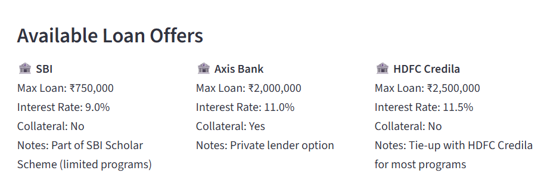
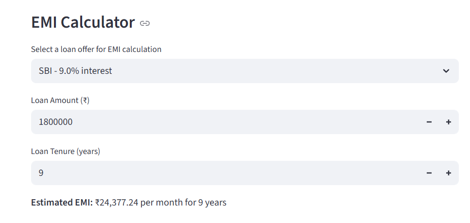

**🎓 EduLoanMap: Your College Loan Navigator 🚀**
**🌟 Overview**

Education is the key to a brighter future, but soaring college fees often block the way — especially for hardworking families with modest incomes. Many students and parents don’t know about easy student loans offered by banks, some even without collateral! That’s where EduLoanMap comes in — a simple, smart tool to find, compare, and calculate student loans for your college dreams! 🎯

**🚀 Features**

🔍 Search colleges and branches effortlessly

🏦 Compare loan offers from multiple banks side-by-side

💰 See loan amounts, interest rates, and collateral requirements clearly

🧮 EMI Calculator to plan your monthly repayments easily

💡 Motivation

As a student myself, facing hefty college fees was daunting. Even though my college partnered with banks offering collateral-free loans, many of us didn’t know how to access them. EduLoanMap is built to bridge this knowledge gap and help students and parents take charge of their education financing! 🎓💪

**🏃 How to Run**

**First create a project folder and save the app.py and colleges.csv in it**

**Now Do these Steps in your Command Prompt Window**

**Navigate to the Project Folder:**

cd C:\Users\YourName\Documents\EduLoanMap

**Create and Activate a Virtual Environment**

python -m venv venv
venv\Scripts\activate

**Install Dependencies**

pip install streamlit pandas

**Run the app:**

streamlit run app.py

Open the URL shown in the terminal to explore your loan options! 🌐

## 🔍 App Preview

### 🏫 College Search & Loan Offers

 

---

### 💸 EMI Calculator – Plan Your Repayment

**🌈 Future Plans**

Add more colleges & banks — the bigger, the better! 🏫

Smart search with auto-suggestions & fuzzy matching 🤖

Deploy online so everyone can access it anytime, anywhere ☁️

Collect user feedback & reviews for better loan decisions 📢

**📬 Contact**

Got questions, feedback, or want to collaborate? Reach out!

M Kathiravan

✉️ kathiravan.m2025@vitstudent.ac.in

