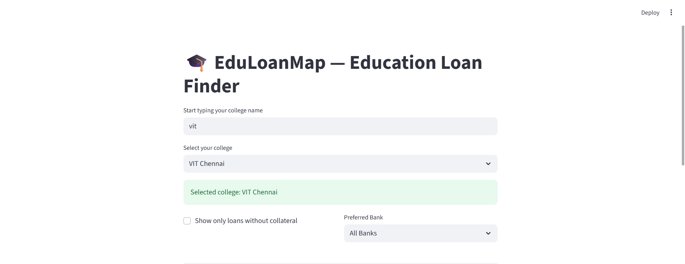

**🎓 EduLoanMap: Your College Loan Navigator 🚀**
**🌟 Overview**

Education is the key to a brighter future, but soaring college fees often block the way — especially for hardworking families with modest incomes. Many students and parents don’t know about easy student loans offered by banks, some even without collateral! That’s where EduLoanMap comes in — a simple, smart tool to find, compare, and calculate student loans for your college dreams! 🎯

**🚀 Features**

🔍 Search colleges and branches effortlessly

🏦 Compare loan offers from multiple banks side-by-side

💰 See loan amounts, interest rates, and collateral requirements clearly

🧮 EMI Calculator to plan your monthly repayments easily

💡 Motivation

As a student myself, facing hefty college fees was daunting. Even though my college partnered with banks offering collateral-free loans, many of us didn’t know how to access them. EduLoanMap is built to bridge this knowledge gap and help students and parents take charge of their education financing! 🎓💪

## 📊 Dataset Details

The project uses a dataset file named `colleges.csv`, which contains loan-related information for various colleges and their branches.

### 🧾 File: `colleges.csv`

Each row in the CSV represents a specific **college branch** and the **loan offer** details available for students in that branch.

### 🔍 Sample Entries

### 📁 Columns

| Column Name       | Description                                                                 |
|-------------------|-----------------------------------------------------------------------------|
| `College Name`    | Name of the college (e.g., "ABC Institute of Technology")                   |
| `Branch`          | Department or course (e.g., "Computer Science", "Mechanical Engineering")   |
| `Bank`            | Name of the bank providing the loan (e.g., "State Bank of India")           |
| `Loan Amount`     | Maximum loan amount available (in INR) (e.g., "10,00,000")                  |
| `Interest Rate`   | Interest rate offered for the loan (e.g., "7.5%")                           |
| `Collateral`      | Whether collateral is required ("Yes" or "No")                              |

**🏃 How to Run**

**First create a project folder and save the app.py and colleges.csv in it**

**Now Do these Steps in your Command Prompt Window**

**Navigate to the Project Folder:**

cd C:\Users\YourName\Documents\EduLoanMap

**Create and Activate a Virtual Environment**

python -m venv venv
venv\Scripts\activate

**Install Dependencies**

pip install streamlit pandas

**Run the app:**

streamlit run app.py

Open the URL shown in the terminal to explore your loan options! 🌐

## 🔍 App Preview

### 🏫 College Search & Loan Offers

 

---

### 💸 EMI Calculator – Plan Your Repayment

**🌈 Future Plans**

Add more colleges & banks — the bigger, the better! 🏫

Smart search with auto-suggestions & fuzzy matching 🤖

Deploy online so everyone can access it anytime, anywhere ☁️

Collect user feedback & reviews for better loan decisions 📢

**📬 Contact**

Got questions, feedback, or want to collaborate? Reach out!

M Kathiravan

✉️ kathiravan.m2025@vitstudent.ac.in

